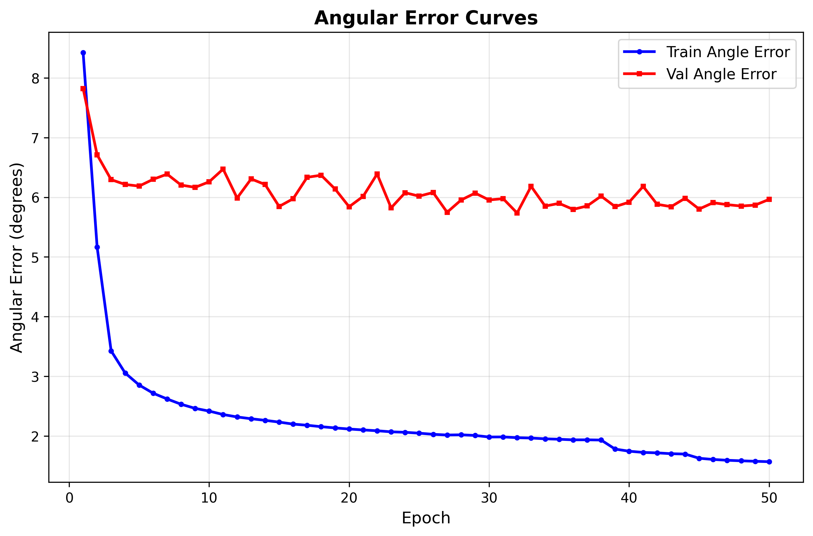
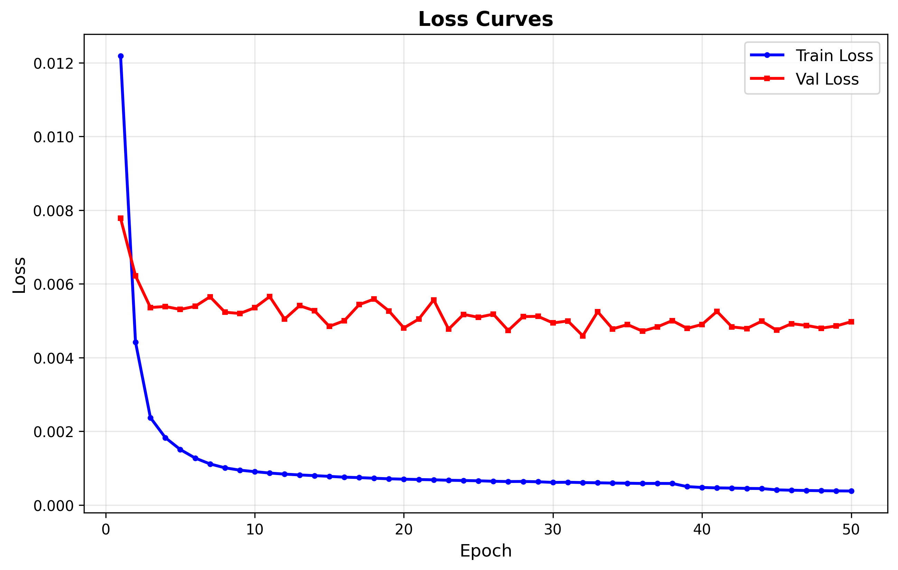

# SwinUNet-VOG 算法概况

## 1. 算法 Pipeline
核心流程围绕“**视频/图像 → 眼部 ROI → SwinUNet → 3D gaze**”展开，分为三步：

```
┌──────────────────────────────────────────────────────────┐
│ Step 1: 输入数据                                         │
│  - 数据集：MPIIGaze 已归一化眼图                     │
│  - 摄像头或视频帧                             │
└───────────────┬───────────────────────────────┬─────────┘
                │                               │
                │                              使用 face_alignment
                │                      获取 2D 脸部关键点并裁剪单眼
                ▼                               ▼
┌──────────────────────────────────────────────────────────┐
│ Step 2: 眼部 ROI 归一化                                   │
│  - 仿射对齐：通过关键点将眼睛旋正                         │
│  - 尺度统一：裁剪并缩放到模型输入尺寸 (36×60×3)           │
└──────────────────────────┬───────────────────────────────┘
                           ▼
┌──────────────────────────────────────────────────────────┐
│ Step 3: SwinUNet 推理                                     │
│  Encoder：SwinBlock + Conv 下采样提取多尺度特征           │
│  Bottleneck：SwinBlock                                   │
│  Decoder：上采样 + SwinBlock 重建语义                    │
│  Head：Adaptive Pool + MLP → 输出 3D gaze 向量            │
└──────────────────────────────────────────────────────────┘
```

说明：
- **模型输入**：MPIIGaze 的归一化眼图直接满足输入尺寸，实际情况的摄像头采集的帧则通过 face_alignment + 仿射变换将原始帧裁剪为同样规格的 ROI。注：face_alignment是基于google的mediapipe现有的2D关键点检测模型。
- **SwinUNet 结构**：编码端堆叠 `SwinBlock + Conv` 完成下采样，解码端使用上采样再接 `SwinBlock` 恢复分辨率，最后经全连接头输出 `3×1` 的 gaze 向量（注视点x,y,z坐标）。

## 2. 训练记录
- **角度误差曲线**  
    
  训练误差持续下降，验证误差在 6° 左右波动。
- **损失曲线**  
    
  与角度误差趋势一致，训练集稳定收敛。
- **误差分布**  
    
  平均角误差约 5.7°，中位数约 4.8°。

## 3. 效果展示

